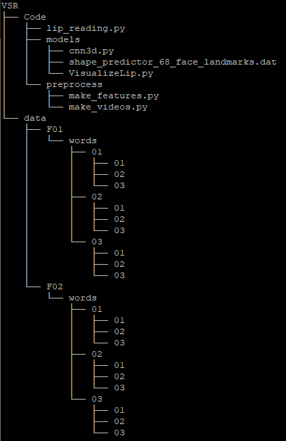

# Running Visual Speech Recognition using 3D-CNN

## Dataset: MIRACL-VC1
Link to the dataset: https://sites.google.com/site/achrafbenhamadou/-datasets/miracl-vc1. There will be 10-15 zip files. Download and extract them.

## Pre-process Data
### Convert video to images
The datatset will be a video so that it must be converted into a set of images. The models/VisualizeLip.py file does this. This file takes in 1 mandatory command-line input _**input**_ where *input* is the input path to video file. The _**output**_ path is hard-coded in such a way that it is compatible with the main script. Refer to the example below:

> **Code/models$** python VisualizeLip.py --input "C:\Users\example\Downloads\mirac"

Make sure that the directory structure of VSR looks something like this (omitting **Phrases** from the **data**)

## Predict output
Run the lip_reading.py file to predict the outputs of lip movements. Look at the example below:

> **Code$** python lip_reading.py

The output is redirected into a file called **pred_out.txt**.
